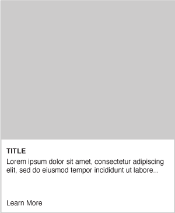

<p align="center">
  
</p>
<h2 align="center">Voice Web Frontend Interview</h2>

This is a [Next.js](https://nextjs.org/) project bootstrapped with
[`create-next-app`](https://github.com/vercel/next.js/tree/canary/packages/create-next-app).

## Requirements

### Node Version

To make sure we isolate our dependencies, the application uses a `.nvmrc` file to lock the node version.

Use the `nvm use` command to set the default node version found in `.nvmrc`. Similarly if the specified node version is
not installed simply run `nvm install`.

_To invoke `nvm` automatically in your shell when changing directories, SEE:_
https://github.com/nvm-sh/nvm#deeper-shell-integration

## Instructions

### Clone the repo

```js
git clone git@github.com:voice-social/voice-frontend-interview.git
```

### Install dependencies

```bash
npm i
# or
yarn
```

### Run the development server:

```bash
npm run dev
# or
yarn dev
```

Open [http://localhost:3000](http://localhost:3000) with your browser to see the result.

You can start editing the page by modifying `src/components/Pages/Home/index.tsx`. The page auto-updates as you edit the
file.

### Build a reusable `Card` component.



Create mock card data, for example:

```js
const cardData = [
  {
    image: ''
    ...
  },
]
```

- Create a card component that contains the following:
  - image that is clickable (https://via.placeholder.com/150)
  - title
  - description
  - cta with the text "Learn More"
  - display these cards in a grid with basic styles\*
  - make it responsive\*

_(\*) nice to haves if time permits_
